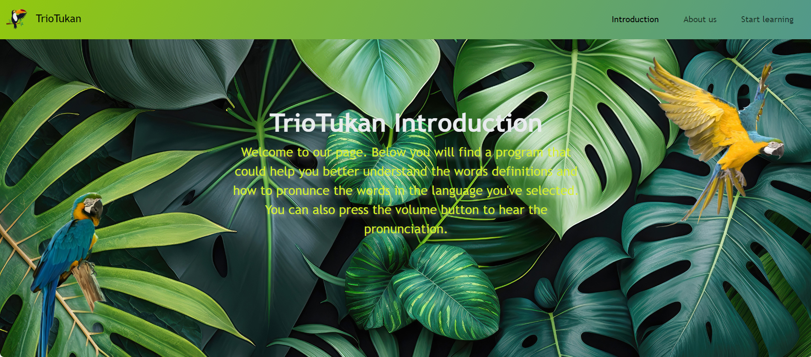

# trio-tukan-language-learning

Language Application.

## Description

This project it's a learning application that can help you learn the definition of a chosen word and translate it to Spanish. The motivation of this project was to create a simple but efective learning application, that can take input in text and speech.

API Keys you can try: 

- word API => 
- translate API => 

## Features

It contains an event listener in order to obtain the definition of the word chosen by the user. 

It contains a translation event which is automatically activated when the word presses the event listener.

It contains a speech - text functionality.

## Installation.

Clone this repository to your local machine using Git bash command line: git clone git@github.com:gabrielstirbu/trio-tukan-language-learning.git

Open the project folder in your code editor.

Open the HTML file in your browser.

Here's a screenshot of what you should see at the first glance: 

## Deployment 

For the deployment of the website, you'll only have to click on the link below and use it on an acceptable browser.

https://gabrielstirbu.github.io/trio-tukan-language-learning/

## Built with

This project was build with HTML, CSS, JavaScript, jQuery, Web API.

## Authors

Gabriel Stirbu, Gabriel Pamfil, Radu Oros.

## License

The MIT License

Permission is hereby granted, free of charge, to any person obtaining a copy of this software and associated documentation files (the “Software”), to deal in the Software without restriction, including without limitation the rights to use, copy, modify, merge, publish, distribute, sublicense, and/or sell copies of the Software, and to permit persons to whom the Software is furnished to do so, subject to the following conditions:
The above copyright notice and this permission notice shall be included in all copies or substantial portions of the Software.
THE SOFTWARE IS PROVIDED “AS IS”, WITHOUT WARRANTY OF ANY KIND, EXPRESS OR IMPLIED, INCLUDING BUT NOT LIMITED TO THE WARRANTIES OF MERCHANTABILITY, FITNESS FOR A PARTICULAR PURPOSE AND NONINFRINGEMENT. IN NO EVENT SHALL THE AUTHORS OR COPYRIGHT HOLDERS BE LIABLE FOR ANY CLAIM, DAMAGES OR OTHER LIABILITY, WHETHER IN AN ACTION OF CONTRACT, TORT OR OTHERWISE, ARISING FROM, OUT OF OR IN CONNECTION WITH THE SOFTWARE OR THE USE OR OTHER DEALINGS IN THE SOFTWARE.

## Acknowledgments

RapidAPI, GhatGPT, Stack Overflow, YouTube.

## Contact 

E-mail: gabrielpamfil2000@yahoo.com
        gabriel.stirbu@hotmail.com
        oros.radu93@yahoo.com